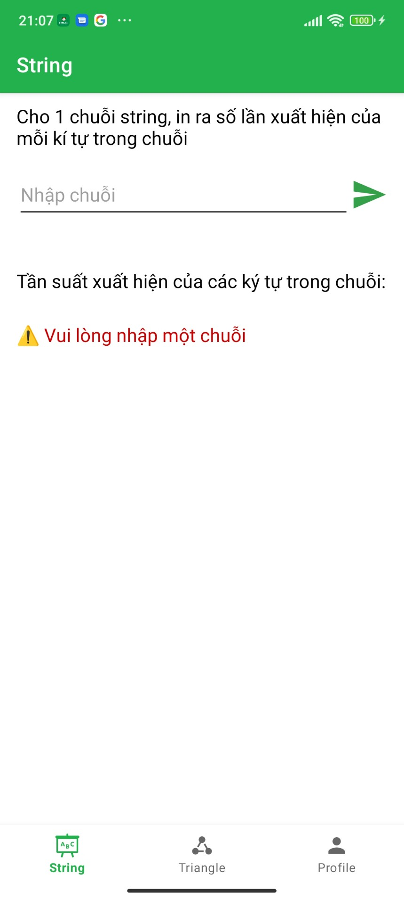
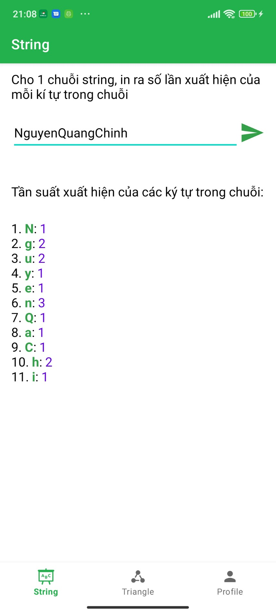
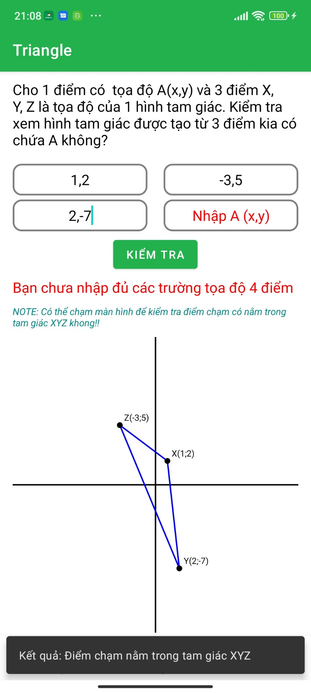
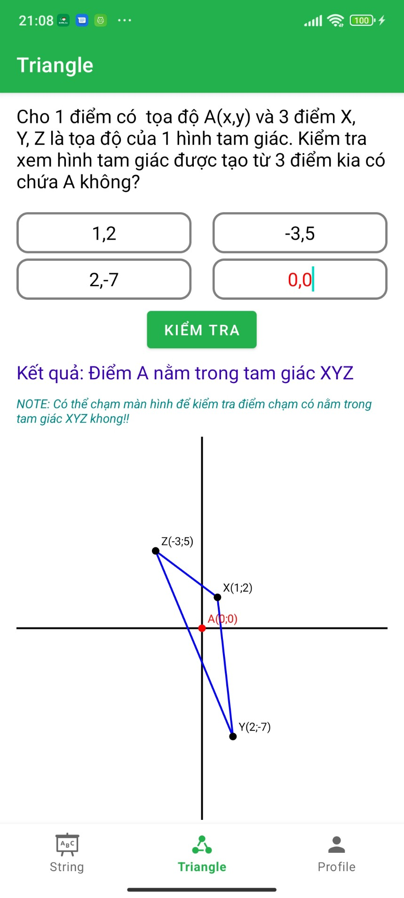
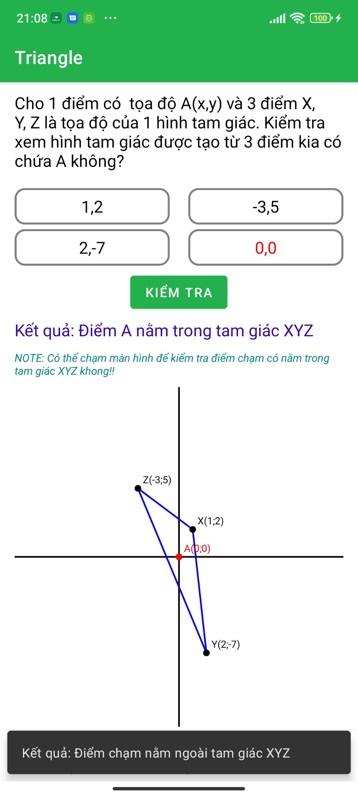

# GAndroid App

## Giới Thiệu

Bài tập tìm hiểu các components, android lifecycle, dùng mô hình MVVM.

## Các thành phần chính

- **String**: Cho 1 chuỗi String, in ra số lần xuất hiện của mỗi kí tự trong chuỗi. 
- **Triangle**: Cho 1 điểm có  tọa độ A(x,y) và 3 điểm là tọa độ của 1 hình tam giác, tạo hàm kiểm tra xem hình tam giác được tạo từ 3 điểm kia có chứa A không.
- **Profile**: Cấu trúc lại giao diện được cung cấp.

## Cài Đặt

### Yêu Cầu

- Android Studio phiên bản 4.0 trở lên.
- Android SDK 24 hoặc cao hơn.

### Cài Đặt Dự Án

1. **Clone Repository**

   ```sh
   https://github.com/21020337-LuongThiThuHuong/GAndroidApp.git

2. **Mở Dự Án Trong Android Studio**

   - Mở Android Studio.
   - Chọn "Open an Existing Project" và chọn thư mục chứa dự án đã clone.

4. **Chạy Ứng Dụng**

   - Kết nối thiết bị Android hoặc mở trình giả lập.
   - Chạy ứng dụng từ Android Studio bằng cách nhấn nút "Run"

## Chi tiết chức năng

**1. String**

- _Nhập và xử lý chuỗi ký tự_: Người dùng có thể nhập một chuỗi ký tự vào `EditText`.
- _Hiển thị kết quả_: Khi người dùng nhấn vào nút "OK", chuỗi ký tự sẽ được xử lý để đếm số lần xuất hiện của từng ký tự trong chuỗi. 
- _Hiển thị lỗi_: Nếu người dùng không nhập bất kỳ chuỗi nào, một thông báo sẽ được hiển thị yêu cầu người dùng nhập chuỗi.

  

**2. Triangle**

- _Nhập và xử lý tọa độ điểm_: Người dùng nhập tọa độ các điểm vào các `EditText` (A, X, Y, Z).
- _Vẽ tam giác và kiểm tra điểm_: Khi người dùng nhấn nút "Vẽ", tọa độ các điểm được xử lý để kiểm tra điểm A có nằm trong tam giác XYZ hay không. Kết quả được hiển thị trong `TextView`.
- _Hiển thị lỗi_: Nếu người dùng nhập sai định dạng hoặc không nhập đủ tọa độ, một thông báo lỗi sẽ được hiển thị.
- **_Toast vị trí điểm touch_**: Ngoài việc nhập điểm A thì người dùng có thể chạm vào vị trí bất kỳ trên màn hình để kiểm tra điểm vừa chạm có nằm trong tam giác X, Y, Z khong.

  

**3. Quản Lý Hồ Sơ**

- _Cấu trúc lại giao diện_: Thiết kế lại giao diện profile như trong slide.
- _Mô tả loading_: Sử dụng delay time 2s để mô tả loading như lấy data từ file json được cấp.

 

**4. Vid demo**

https://github.com/user-attachments/assets/aba2289b-f13c-4112-be09-b8807b85f212


